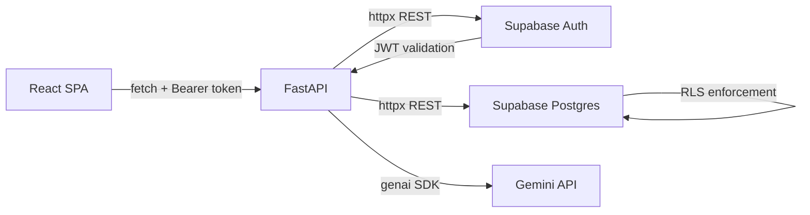
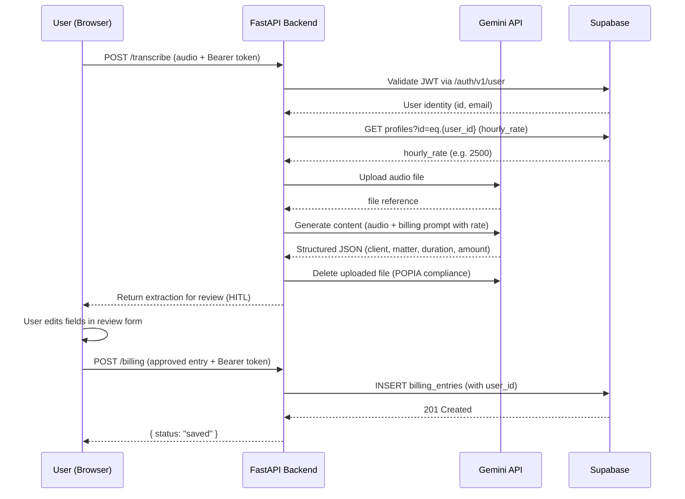

# Architecture

## System Overview

LexFlow follows a monolithic deployment pattern with clear separation between the API layer and the client SPA. A single FastAPI process serves both the REST API and the compiled React frontend via static file mounting.



---

## Data Flow: Voice Note to Billing Entry



---

## Stack Decisions

### Why FastAPI over Django

FastAPI is async-first. The Gemini API call (audio upload + generation) takes 5-15 seconds. In Django, this blocks the WSGI worker. FastAPI handles it natively with `async/await`, keeping the server responsive during LLM latency. FastAPI also generates OpenAPI docs automatically and has native Pydantic integration for structured AI output validation.

### Why Supabase over Firebase

Row Level Security (RLS) is the key differentiator. Supabase enforces data isolation at the database level — a user physically cannot query another user's billing entries, even if the application code has a bug. Firebase Security Rules offer similar protection, but PostgreSQL's RLS is more natural for relational data and complex queries (joins, aggregations, CSV exports). Supabase also provides a standard REST API, making the backend stateless and easy to test.

### Why httpx over supabase-py

The official `supabase-py` package depends on `httpx` plus several C extensions (`gotrue`, `postgrest-py`, `realtime-py`). These fail to compile on Windows development machines and on Render's build environment without additional system dependencies. Using `httpx` directly against Supabase's REST API eliminates all C-extension build issues while providing the same functionality with fewer failure modes.

### Why Human-in-the-Loop (HITL) over Auto-Save

Legal billing demands accuracy. An AI extraction is a draft, not a fact. If the model misidentifies a client name or estimates duration incorrectly, automatically saving that to a FICA-compliant ledger creates a compliance risk. The HITL pattern — present, review, approve — is standard in enterprise AI workflows and demonstrates production-grade thinking.

### Why Sonner over Default Alerts

Sonner provides an `unstyled` mode that allows complete visual control. The toasts match the existing design system (frosted glass, tight typography, subtle accent borders) instead of looking like a generic library bolted on.

---

## Security Model

```
┌─────────────────────────────────────────────────┐
│                  Browser (SPA)                   │
│  supabaseClient.ts → Supabase Auth (anon key)   │
│  Stores JWT in memory (no localStorage)          │
└────────────────────┬────────────────────────────┘
                     │ Bearer token
┌────────────────────▼────────────────────────────┐
│               FastAPI Backend                    │
│  get_current_user() → validates JWT via          │
│  Supabase /auth/v1/user endpoint                 │
│  Extracts user.id for all DB operations          │
└────────────────────┬────────────────────────────┘
                     │ Service key (server-side only)
┌────────────────────▼────────────────────────────┐
│            Supabase PostgreSQL                   │
│  RLS Policy: billing_entries.user_id = auth.uid()│
│  Even with service key bypass, user_id is always │
│  set from the validated JWT, never from client   │
└─────────────────────────────────────────────────┘
```

**Key points:**
- The anon key is public (safe to expose in frontend). It only grants access through RLS.
- The service key is server-side only, used for admin operations like demo data seeding.
- Audio files are never stored. They exist in memory during processing, are uploaded to Gemini for extraction, and immediately deleted via `files.delete()` in a `finally` block (POPIA/GDPR compliance).

---

## Scope and Trade-offs

### What was explicitly deferred

| Feature | Reason for deferral |
|---------|-------------------|
| Multi-tenant admin panel | Focus on core AI extraction accuracy for individual users first |
| WebSocket real-time updates | Polling every 15s is sufficient for billing frequency; WebSockets add deployment complexity |
| Multi-currency support | App targets SA legal market; adding USD/GBP selection adds DB + prompt complexity for no current users |
| PDF invoice generation | CSV export satisfies FICA compliance; PDF styling is high-effort, low-signal for the MVP |
| Background job queue | Audio processing takes ~10s; a toast notification is sufficient UX at current scale |
| Offline/PWA support | Legal billing requires server-side AI processing; offline mode would be misleading |

### What would change at scale

- **Job queue** (Celery/Redis) for async audio processing if >10 concurrent users
- **Supabase Storage** for audio archival if client requests recording retention
- **Rate-based pricing tiers** via Stripe for multi-firm deployments
- **Audit trail table** for compliance logging of all data modifications

---

## Deployment

### Render (Production)

```yaml
# render.yaml
services:
  - type: web
    name: lexflow
    runtime: python
    buildCommand: npm --prefix frontend install && npm --prefix frontend run build && pip install -r requirements.txt
    startCommand: uvicorn main:app --host 0.0.0.0 --port $PORT
```

### Docker (Local/Self-hosted)

```bash
docker compose up --build
# → http://localhost:8000
```

The multi-stage Dockerfile builds the React frontend in a Node container, then copies the compiled `dist/` into a slim Python image. Final image is ~150MB.
