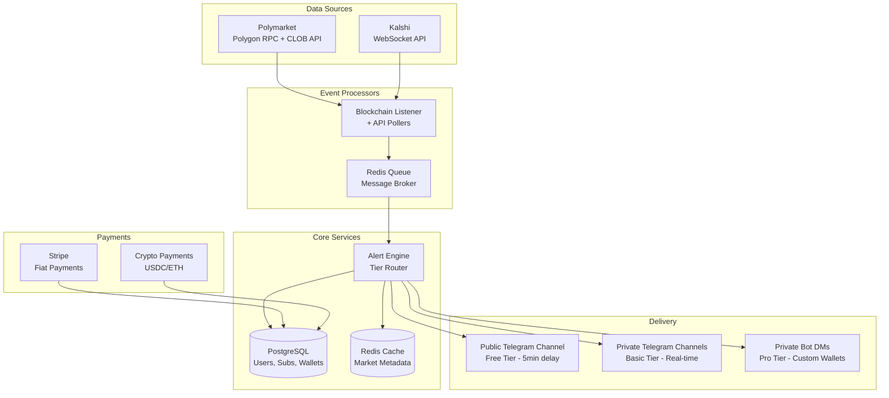

# Prediction Market Wallet Alert Bot - Implementation Plan

A Telegram bot that monitors wallet activity on **Polymarket** (Polygon blockchain) and **Kalshi** (centralized exchange), delivering real-time alerts to subscribers across three pricing tiers.

---

## User Review Required

> [!IMPORTANT]
> **Kalshi Limitation**: Kalshi is a CFTC-regulated centralized exchange, NOT a blockchain. It doesn't have public wallet addresses like Polymarket. Tracking "wallets" on Kalshi means tracking **user accounts via their API** - which requires users to provide their own Kalshi API credentials. This is a fundamentally different model than Polymarket wallet tracking.

> [!WARNING]  
> **API Access Considerations**:
> - Polymarket's public API allows tracking any wallet without authentication
> - Kalshi's API requires authenticated access; tracking other users' activity may be limited to public leaderboard/trade feed data only
> - Consider whether to support Kalshi at launch or add it as Phase 2

---

## System Architecture



---

## Tech Stack Recommendations

| Component | Choice | Rationale |
|-----------|--------|-----------|
| **Language** | Python 3.11+ | Best ecosystem for Web3 + Telegram bots |
| **Framework** | FastAPI | Async, webhooks, admin endpoints |
| **Telegram** | python-telegram-bot v20+ | Async, feature-complete |
| **Database** | PostgreSQL (Supabase free tier) | Reliable, free hosting available |
| **Cache/Queue** | Redis (Upstash free tier) | Pub/sub for real-time, queue for delays |
| **Blockchain** | web3.py + Alchemy/QuickNode | Polygon RPC with WebSocket support |
| **Hosting** | Railway / Fly.io | Cheap ($5-20/mo), simple deployment |
| **Payments** | Stripe + thirdweb Pay | Fiat + crypto in one flow |

**Estimated Monthly Costs (MVP)**:
- Hosting: $5-10 (Railway hobby tier)
- Database: $0 (Supabase free tier)
- Redis: $0 (Upstash free tier)  
- Polygon RPC: $0-49 (Alchemy free tier = 300M compute units)
- **Total: ~$10-20/month** until you scale

---

## Proposed Changes

### Core Bot Application

#### [NEW] [main.py](file:///C:/Users/USER-PC/.gemini/antigravity/scratch/prediction-market-alerts/src/main.py)
- Entry point with FastAPI app
- Telegram webhook registration
- Health check endpoints

#### [NEW] [bot/telegram_bot.py](file:///C:/Users/USER-PC/.gemini/antigravity/scratch/prediction-market-alerts/src/bot/telegram_bot.py)  
- Telegram bot command handlers (`/start`, `/subscribe`, `/track`, `/status`)
- Inline keyboard for tier selection
- Subscription state machine

#### [NEW] [bot/commands/](file:///C:/Users/USER-PC/.gemini/antigravity/scratch/prediction-market-alerts/src/bot/commands/)
- `/start` - Onboarding flow
- `/subscribe` - Payment flow initiation
- `/track <wallet>` - Pro tier wallet tracking
- `/untrack <wallet>` - Remove custom wallet
- `/wallets` - List tracked wallets
- `/help` - Usage instructions

---

### Data Source Integrations

#### [NEW] [listeners/polymarket.py](file:///C:/Users/USER-PC/.gemini/antigravity/scratch/prediction-market-alerts/src/listeners/polymarket.py)
- WebSocket connection to Polygon RPC for new blocks
- Filter for Polymarket CTF Exchange contract events
- Decode ERC-1155 token transfers (position opens/closes)
- Map token IDs to market metadata via Gamma API

**Key Polymarket Contracts (Polygon)**:
```
CTF Exchange: 0x4bFb41d5B3570DeFd03C39a9A4D8dE6Bd8B8982E
Conditional Tokens: 0x4D97DCd97eC945f40cF65F87097ACe5EA0476045
USDC: 0x2791Bca1f2de4661ED88A30C99A7a9449Aa84174
```

#### [NEW] [listeners/kalshi.py](file:///C:/Users/USER-PC/.gemini/antigravity/scratch/prediction-market-alerts/src/listeners/kalshi.py)
- WebSocket connection to Kalshi trade feed
- Track large public trades (>$50k) for free tier
- Authenticated connection for user's own positions (Pro tier)

---

### Alert Engine

#### [NEW] [alerts/engine.py](file:///C:/Users/USER-PC/.gemini/antigravity/scratch/prediction-market-alerts/src/alerts/engine.py)
- Event router based on subscription tier
- Delay queue for free tier (5-minute buffer)
- Real-time dispatch for paid tiers
- Rate limiting per user

#### [NEW] [alerts/formatters.py](file:///C:/Users/USER-PC/.gemini/antigravity/scratch/prediction-market-alerts/src/alerts/formatters.py)
- Rich Telegram message formatting
- Market link generation
- Copy-trading JSON payload generation (Pro tier)

**Example Alert Message (Basic Tier)**:
```
🐋 WHALE ALERT - Polymarket

Wallet: 0x1234...5678
Action: BUY $125,000 YES

Market: Will Trump win 2024 election?
Current Odds: YES 52¢ | NO 48¢

🔗 View Market: polymarket.com/event/...
📊 See all whale activity: /whales
```

---

### Database Models

#### [NEW] [models/](file:///C:/Users/USER-PC/.gemini/antigravity/scratch/prediction-market-alerts/src/models/)

```python
# users.py
class User:
    telegram_id: int
    username: str
    tier: Tier  # FREE, BASIC, PRO
    subscription_expires: datetime
    stripe_customer_id: str | None
    created_at: datetime

# wallets.py  
class TrackedWallet:
    address: str
    platform: Platform  # POLYMARKET, KALSHI
    label: str  # "Whale #1", "My Copy Target"
    is_public: bool  # True = tracked for all, False = Pro user's private
    added_by: int | None  # User ID for private wallets

# subscriptions.py
class Subscription:
    user_id: int
    tier: Tier
    payment_method: PaymentMethod  # STRIPE, CRYPTO
    amount_usd: Decimal
    started_at: datetime
    expires_at: datetime
    tx_hash: str | None  # For crypto payments
```

---

### Payment Integration

#### [NEW] [payments/stripe_handler.py](file:///C:/Users/USER-PC/.gemini/antigravity/scratch/prediction-market-alerts/src/payments/stripe_handler.py)
- Stripe Checkout session creation
- Webhook handler for payment events
- Subscription renewal flow

#### [NEW] [payments/crypto_handler.py](file:///C:/Users/USER-PC/.gemini/antigravity/scratch/prediction-market-alerts/src/payments/crypto_handler.py)
- Generate unique payment addresses per user
- Monitor for incoming USDC/ETH payments
- Automatic tier upgrade on payment confirmation

---

### Configuration & Infrastructure

#### [NEW] [config.py](file:///C:/Users/USER-PC/.gemini/antigravity/scratch/prediction-market-alerts/src/config.py)
- Environment variable management
- Tier pricing configuration
- Whale threshold settings

#### [NEW] [docker-compose.yml](file:///C:/Users/USER-PC/.gemini/antigravity/scratch/prediction-market-alerts/docker-compose.yml)
- Local development setup
- PostgreSQL + Redis containers

#### [NEW] [.env.example](file:///C:/Users/USER-PC/.gemini/antigravity/scratch/prediction-market-alerts/.env.example)
- Template for required environment variables

---

## Tier Implementation Details

| Feature | Free | Basic ($29/mo) | Pro ($149/mo) |
|---------|------|----------------|---------------|
| Alert Delay | 5 minutes | Real-time | Real-time |
| Bet Threshold | >$50,000 only | All whale bets | All bets |
| Market Links | ❌ | ✅ | ✅ |
| Custom Wallets | ❌ | ❌ | ✅ (up to 10) |
| Copy-Trade JSON | ❌ | ❌ | ✅ |
| Delivery | Public Channel | Private Channel | Private Bot DM |
| Platforms | Polymarket only | Polymarket + Kalshi | Both + priority |

---

## Phased Development Plan

### Phase 1: MVP (Week 1-2)
- [ ] Project setup, Docker config
- [ ] Polymarket listener (track whale wallets)
- [ ] Basic Telegram bot with `/start`, `/help`
- [ ] Free tier: Public channel, 5-min delayed alerts
- [ ] Deploy to Railway

### Phase 2: Monetization (Week 3-4)
- [ ] Stripe integration
- [ ] Basic tier: Private channel, real-time
- [ ] User database and subscription management
- [ ] Payment webhooks

### Phase 3: Pro Features (Week 5-6)
- [ ] Custom wallet tracking
- [ ] Copy-trading JSON payloads
- [ ] Crypto payment support
- [ ] Pro tier private bot interactions

### Phase 4: Kalshi + Polish (Week 7-8)
- [ ] Kalshi API integration
- [ ] Admin dashboard (optional)
- [ ] Analytics and monitoring
- [ ] Rate limiting and abuse prevention

---

## Verification Plan

### Automated Tests
```bash
# Unit tests for alert formatting
pytest tests/test_formatters.py -v

# Integration tests for Polymarket listener
pytest tests/test_polymarket_listener.py -v

# End-to-end subscription flow
pytest tests/test_subscription_flow.py -v
```

### Manual Verification
1. **Free Tier Test**: Join public channel, trigger a >$50k whale trade on Polygon testnet, verify alert arrives after 5 minutes
2. **Basic Tier Test**: Subscribe via Stripe test mode, verify real-time alerts in private channel
3. **Pro Tier Test**: Use `/track` command with a test wallet, verify custom alerts work
4. **Payment Test**: Complete Stripe checkout, verify tier upgrade in database

---

## Questions for You

1. **Kalshi Strategy**: Given the API limitations, should we:
   - (A) Launch with Polymarket only, add Kalshi later
   - (B) Support Kalshi from day 1 with limited features (public trade feed only)
   - (C) Skip Kalshi entirely and focus on Polymarket depth

2. **Whale Wallet Sourcing**: Do you have a list of known whale wallets to track, or should I include logic to auto-discover them based on trading volume?

3. **Pricing Confirmation**: I've set Basic at $29/mo and Pro at $149/mo. Want to adjust these?

4. **Discord Addition**: You mentioned Discord initially - should I include Discord bot scaffolding in the plan, or is Telegram-only fine for v1?
